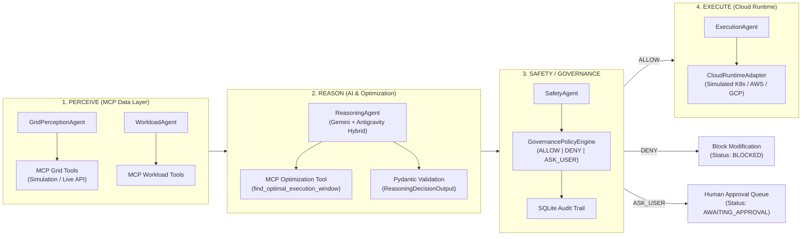

# GridAgent-AI: System Architecture & Engineering Specification

## 1. High-Level Architecture (`PERCEIVE → REASON → SAFETY CHECK → EXECUTE`)

## 2. Separation of Simulation Data vs. Live API Telemetry

GridAgent-AI implements the `GridDataProvider` abstract base class (`backend/simulation/grid_simulator.py`):
- **`SimulatedGridDataProvider`**: Deterministic 24-hour electricity grid simulator supporting multiple diurnal profiles (`demo_default`, `solar_duck_curve`, `high_carbon_stress`). All responses explicitly carry `is_simulated: true` and `data_source: "SIMULATION_ENGINE"`.
- **`ElectricityMapsLiveAdapter`**: Pluggable live telemetry adapter for the Electricity Maps v3 API (`GRID_DATA_PROVIDER=LIVE_API`).

## 3. Multi-Agent Responsibilities

1. **`GridPerceptionAgent` (`backend/agents/perception_agent.py`)**: Queries MCP grid tools for current carbon intensity (`gCO2/kWh`), 24-hour forecast, solar/wind generation (`MW`), renewable share (`%`), and dynamic tariff pricing (`$/kWh`).
2. **`WorkloadAgent` (`backend/agents/workload_agent.py`)**: Queries MCP workload tools to inspect queued enterprise jobs, durations, priorities, energy budgets, and SLA deadlines.
3. **`ReasoningAgent` (`backend/agents/reasoning_agent.py`)**: Invokes `find_optimal_execution_window` and synthesizes explainable scheduling justifications (with optional Google Gemini LLM enrichment via the Antigravity environment), strictly validated by the `ReasoningDecisionOutput` Pydantic schema.
4. **`SafetyAgent` (`backend/agents/safety_agent.py`)**: Validates every proposed AI scheduling action against the `GovernancePolicyEngine`. Enforces that the AI agent can **never** override a `DENY` policy.
5. **`ExecutionAgent` (`backend/agents/execution_agent.py`)**: Enforces the policy gate before dispatching state transitions (`QUEUED → DEFERRED`, `QUEUED → RUNNING`, `DEFERRED → RUNNING`, `RUNNING → COMPLETED`, `BLOCKED`, `AWAITING_APPROVAL`) to the `CloudRuntimeAdapter`.
